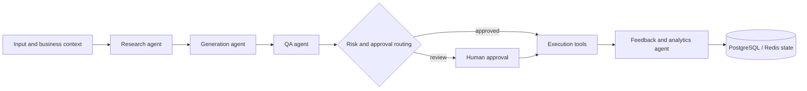

# Agentic LLM & RAG Engineering Portfolio

**Gleb Lutfullin**  
AI Engineer · Agentic Systems · RAG · LLM Backend  
[GitHub](https://github.com/downmeansoff) · [Telegram](https://t.me/oldkindmvn) · [Email](mailto:gleblutfullina@gmail.com)

This portfolio focuses on production agentic systems, retrieval quality, LLM reliability, and AI-native engineering. Customer data, production credentials, private infrastructure identifiers, and proprietary business logic are intentionally omitted.

## Production profile

- **3+ years of commercial engineering**, of which **1.5+ years building production LLM systems**.
- Designed and operated a **7-agent production workflow** across research, generation, QA, approval, and feedback.
- Reduced an end-to-end workflow from **~5 days to under 1 day** and lowered average LLM cost per completed run by **~35%**.
- Built a RAG service with offline evaluation on **54 labeled questions**; improved paraphrase **Recall@1 from 0.50 to 0.65** and **MRR from 0.62 to 0.72** versus a TF-IDF baseline.
- Operated a distributed production platform for **3,000+ users**, **7 nodes**, and **5 client channels**.
- Delivered AI automations for external businesses across marketing, sales, analytics, and operations, from discovery through rollout and user feedback.

---

## Case 1: Multi-agent production workflow

### Problem

A business workflow depended on repeated manual handoffs between research, preparation, quality review, approval, and performance analysis. A single large prompt was difficult to debug, expensive to retry, and unsafe to connect directly to external actions.

### Architecture



### My responsibility

- workflow and agent boundaries;
- tool/function schemas and permissions;
- structured outputs using JSON Schema and Pydantic;
- state transitions and context management;
- bounded retries, timeouts, fallbacks, and stop conditions;
- audit logs, cost/failure tracing, and human approval;
- deployment, monitoring, regression checks, and production support;
- customer discovery, demos, feedback collection, and iteration planning.

### Reliability decisions

- Each step writes a validated state object instead of passing an unbounded conversation history.
- Recoverable errors retry only the failed step; invalid business output returns to a correction or approval path.
- External writes are separated from generation and require explicit policy checks.
- Model choice and context size are routed by task complexity and risk.
- Critical paths have deterministic fallbacks and manual review rather than unlimited agent loops.

### Result

- cycle time: **~5 days → under 1 day**;
- average LLM cost per completed workflow: **~35% lower**;
- five manual handoffs replaced by explicit, observable state transitions;
- failures became attributable to a specific step, model, prompt version, or tool call.

---

## Case 2: Supply-Chain RAG and retrieval evaluation

### Scope

Built a Python/FastAPI RAG service with document preparation, chunking, embeddings, cosine vector retrieval, a `/query` endpoint, and offline evaluation over 54 labeled questions.

### Evaluation

- compared lexical TF-IDF retrieval with neural embeddings;
- measured Recall@k and MRR;
- separated paraphrase, keyword, and factual query classes;
- reviewed context sufficiency and retrieval failure cases;
- tracked which relevant chunk appeared first, not only whether it appeared anywhere.

### Result

- paraphrase Recall@1: **0.50 → 0.65**;
- MRR: **0.62 → 0.72**;
- keyword queries showed no universal dense-search advantage;
- recommended hybrid lexical+dense retrieval and a reranking stage instead of replacing lexical search entirely.

### Public reference

[Agentic RAG Reliability Reference](https://github.com/downmeansoff/agentic-rag-reference) demonstrates Pydantic contracts, lexical+dense fusion through reciprocal-rank fusion, an optional reranker boundary, Recall@k/MRR, failure buckets, and deterministic tests, 166 of them. A shortened excerpt lives [in this repository](agentic-rag-reference/README.md).

---

## Case 3: Distributed production platform

[Distributed Secure Access Platform](https://github.com/downmeansoff/distributed-relay-platform) is a sanitized public architecture reference for a private production system serving 3,000+ users across 7 nodes and 5 client channels.

Relevant engineering controls:

- health-aware routing and automatic unhealthy-node exclusion;
- versioned API contracts and server-owned state;
- staging, smoke tests, rolling deployments, and rollback;
- structured logs, Prometheus metrics, Sentry, and incident runbooks;
- role-separated permissions and human approval for high-impact operations.

This work shaped how I design LLM systems: agents are another distributed component and need the same discipline around contracts, degraded states, observability, release safety, and recovery.

---

## Evaluation and observability approach

For agent and RAG systems I separate three layers of quality:

1. **Deterministic correctness**: schema validation, tool arguments, permissions, idempotency, state transitions, and integration tests.
2. **Offline model quality**: golden sets, retrieval metrics, expected tool paths, prompt/model regression checks, and human-reviewed examples.
3. **Production behavior**: latency, token and model cost, error taxonomy, retry rate, fallback rate, approval rate, and user feedback.

A model or prompt change should be traceable to a version and evaluated against the same scenario set before rollout.

---

## Self-hosted serving readiness

My primary commercial production experience has been with OpenAI, Anthropic, and OpenRouter rather than owning a vLLM cluster. I do not present self-hosted inference as a completed production achievement.

I can work with infrastructure teams on the serving boundary and understand the operational trade-offs around continuous batching, KV-cache pressure, quantization, context length, concurrency, latency versus throughput, OpenAI-compatible APIs, model routing, health checks, and capacity monitoring. I am prepared to deepen hands-on vLLM ownership on the project rather than treating serving as a black box.

---

## AI-native development workflow

Daily tools: **Claude Code, Codex, Cursor, OpenCode, MCP servers, Git worktrees, GitHub Actions**.

```text
Requirement and acceptance criteria
        ↓
Repository analysis and implementation plan
        ↓
Tests, lint/build, security and regression checks
        ↓
Staging and smoke evidence
        ↓
Human production approval and rollback path
```

Agents accelerate implementation and review, but architecture, permissions, acceptance criteria, and production decisions remain human-owned.

## Links

- [Profile and selected projects](https://github.com/downmeansoff)
- [Distributed platform architecture](https://github.com/downmeansoff/distributed-relay-platform)
- [General engineering case studies](CASE_STUDIES.md)
- [CV](CV.md)
