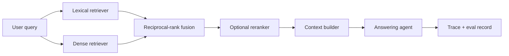

# Agentic RAG Reliability Reference

A compact public reference for the retrieval and quality controls I use when designing production-oriented RAG systems. It is intentionally generic and contains no customer data or private production logic.

## What it demonstrates

- stable Pydantic contracts for chunks and search results;
- lexical retrieval with TF-IDF;
- injected dense embeddings, compatible with local or hosted embedding services;
- reciprocal-rank fusion for hybrid search;
- optional reranker hook, independent from a specific cross-encoder;
- offline metrics: Recall@k and MRR;
- a simple retrieval failure taxonomy for regression analysis;
- deterministic tests with no external API calls.

## Why the components are separated

The retriever should not know whether embeddings come from a provider API, a local sentence-transformer, or a self-hosted endpoint. The orchestrator should not be tied to one reranker. Evaluation should consume normalized hits, not vendor-specific responses. These boundaries make model changes and regression testing easier.



## Run locally

```bash
python -m venv .venv
source .venv/bin/activate
python -m pip install -r requirements.txt
PYTHONPATH=. pytest -q
```

## Production extensions

A production implementation should add:

- persistent document and embedding versioning;
- chunk lineage and source timestamps;
- tenant and permission filters before ranking;
- query classification and adaptive retrieval depth;
- a cross-encoder or LLM reranker with latency budgets;
- context sufficiency checks and abstention rules;
- OpenTelemetry/Langfuse-compatible traces;
- golden sets, model/prompt versions, and CI regression thresholds;
- online feedback and drift monitoring.

## Portfolio context

In a separate RAG project I built document preparation, chunking, embeddings, vector search, a FastAPI query endpoint, and offline evaluation over 54 labeled questions. Neural embeddings improved paraphrase Recall@1 from 0.50 to 0.65 and MRR from 0.62 to 0.72 against a TF-IDF baseline. Exact keyword queries showed that lexical retrieval still mattered, which led to the hybrid design demonstrated here.
